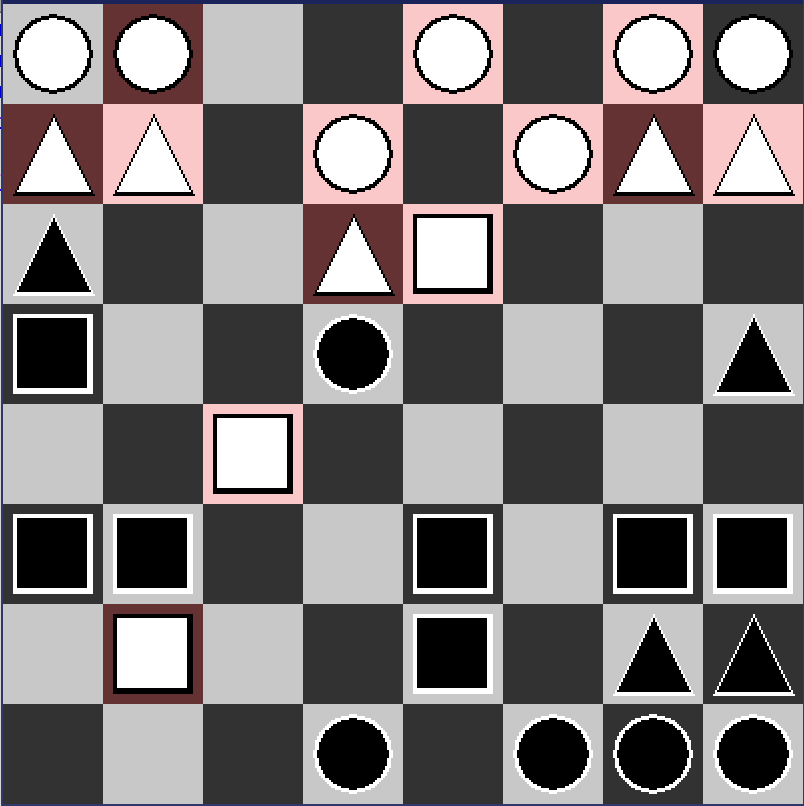

# RPSChess-in-pygame
A python implementation using pygame of the game RPS (Rock Paper Scissors) Chess designed by TailStreak. 
Design document can be found here http://www.leftoversoup.com/archive.php?num=34

To play the game, make sure to have python 3 installed along with the pygame inbrary, the run the myGame.py file.

This implementation is not endorsed by or associated with Mason ‘tailsteak‘ Williams in any way.
